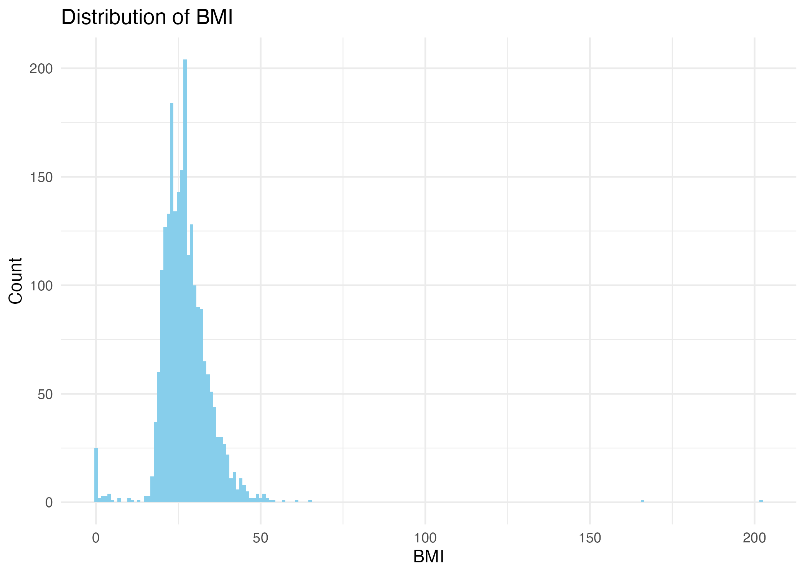

# how-to-display-plots

When we push all R codes and plots to Github, pay attention to:

1. Change "output: html_document" to "output: github_document", 
otherwise Github can't show the rendered html. But also remember, this change is not
apply for interactive documents like "shiny".

2. After click "knit", a new document with ".md" was generated. Push this document,
Github can display this document. 

3. Remember to push the folder contains figures (e.g., here "display_plots_files"), 
otherwise, we can't see the plot in the ".md" document in Github. 

4. If we want to show the plot in read.me file, we can insert the png here using the code:
# "", pay attention to the pathway and the name of the plot.

Another thought: if we want to make a website, we can use R but change the yaml code.

