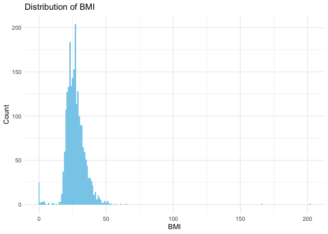

display_plots
================
bublyGudo
2025-11-19

# Library

``` r
library(tidyverse)
```

    ## ── Attaching core tidyverse packages ──────────────────────── tidyverse 2.0.0 ──
    ## ✔ dplyr     1.1.4     ✔ readr     2.1.5
    ## ✔ forcats   1.0.0     ✔ stringr   1.5.1
    ## ✔ ggplot2   3.5.2     ✔ tibble    3.3.0
    ## ✔ lubridate 1.9.4     ✔ tidyr     1.3.1
    ## ✔ purrr     1.1.0     
    ## ── Conflicts ────────────────────────────────────────── tidyverse_conflicts() ──
    ## ✖ dplyr::filter() masks stats::filter()
    ## ✖ dplyr::lag()    masks stats::lag()
    ## ℹ Use the conflicted package (<http://conflicted.r-lib.org/>) to force all conflicts to become errors

``` r
library(readxl)
library(dplyr)
```

# Data

``` r
survey = read_excel("data_source/breast_cancer_survey_data.xlsx")
```

# EDA

``` r
bmi_plot <- survey |>
  ggplot(aes(x = BMI)) +
  geom_histogram(binwidth = 1, fill = "skyblue") +
  labs(title = "Distribution of BMI",
       x = "BMI",
       y = "Count")+
  theme_minimal()

bmi_plot
```

    ## Warning: Removed 97 rows containing non-finite outside the scale range
    ## (`stat_bin()`).

<!-- -->
